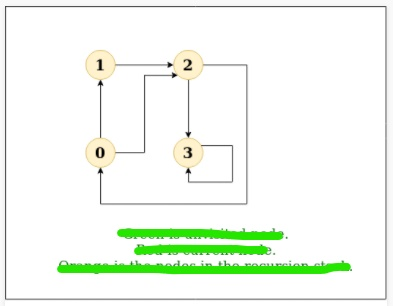
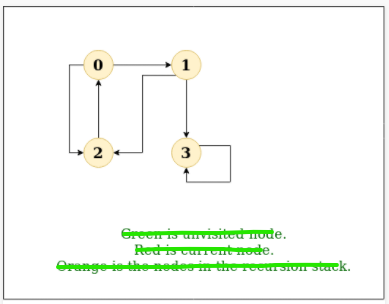
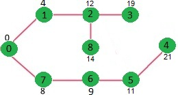

# Graph

- [Graph](#graph)
  - [Breadth First Search or BFS for a Graph](#breadth-first-search-or-bfs-for-a-graph)
    - [Solution](#solution)
  - [Depth First Search or DFS for a Graph](#depth-first-search-or-dfs-for-a-graph)
    - [Solution](#solution-1)
  - [Dijkstra's shortest path](#dijkstras-shortest-path)

<br>

## Breadth First Search or BFS for a Graph
원문링크: https://www.geeksforgeeks.org/breadth-first-search-or-bfs-for-a-graph/

<br>

그래프에서 너비 우선 탐색은 트리의 너비 우선 탐색과 유사합니다. 트리와의 차이점은 그래프는 순환을 포함할 수 있다는 점입니다. 그래서 우리는 동일한 노드로 다시 돌아 올 수도 있습니다. 동일한 노드를 한번 더 처리하는 것을 피하기 위해서 방문 여부를 bool값 형태로 저장하는 배열을 사용합니다. 문제를 단순화하기 위해 모든 vertex들은 시작 지점으로부터 도달 가능하다고 가정하겠습니다.
> Breadth-First Traversal (or Search) for a graph is similar to Breadth-First Traversal of a tree. The only catch here is, unlike trees, graphs may contain cycles, so we may come to the same node again. To avoid processing a node more than once, we use a boolean visited array. For simplicity, it is assumed that all vertices are reachable from the starting vertex.

예를 들어, 아래 그래프는 2번 vertex에서 탐색을 시작합니다. 0번 vertex에 도달했을때 해당 vertex에 인접한 모든 vertex들을 찾습니다. 시작 지점이었던 2번 vertex 또한 0번 vertex에 인접해있습니다. 만약 방문했던 vertex를 표시하지 않는다면 2번 vertex는 다시 한번 처리될 것이고 절대 종료되지 않는 프로세스가 되어버릴 것입니다. 아래 그래프의 너비 우선 탐색 결과는 2, 0, 3, 1 입니다.
> For example, in the following graph, we start traversal from vertex 2. When we come to vertex 0, we look for all adjacent vertices of it. 2 is also an adjacent vertex of 0. If we don’t mark visited vertices, then 2 will be processed again and it will become a non-terminating process. A Breadth-First Traversal of the following graph is 2, 0, 3, 1.


[소스로 이동](https://github.com/chelseafandev/geeksforgeeks/blob/main/Graph/BreadthFirstSearch.cpp)

<br>

### Solution

<br>

<details>
<summary>솔루션 보기</summary>
<div markdown="1">

<br>

```cpp
#include <iostream>
#include <vector>
#include <queue>
#include <set>

class graph
{
public:
    static const int CAPACITY = 100;
    
    graph()
    {
        // init
        for (int i = 0; i < CAPACITY; i++)
        {
            labels_[i] = -1;
        }

        for (int i = 0; i < CAPACITY; i++)
        {
            for (int j = 0; j < CAPACITY; j++)
            {
                edges_[i][j] = false;
            }
        }

        size_ = 0;
    }

    int size() const
    {
        return size_;
    }

    void add_vertex(int val)
    {
        if (size_ < CAPACITY)
        {
            int new_vertex_index = size_;
            size_++;
            
            // set new edge
            for(int i = 0; i < size_; i++)
            {
                edges_[new_vertex_index][i] = false;
                edges_[i][new_vertex_index] = false;
            }

            // set new vertex label
            labels_[new_vertex_index] = val;
        }
    }

    void add_edge(int src, int dst)
    {
        if(src < 0 || src >= size_)
        {
            return;
        }

        if(dst < 0 || dst >= size_)
        {
            return;
        }

        edges_[src][dst] = true;
    }

    // 인자로 전달된 vertex에 인접한 모든 vertex를 반환함
    std::set<int> neighbors(int vertex)
    {
        std::set<int> result;

        for(int i = 0; i < size_; i++)
        {
            if (edges_[vertex][i])
            {
                result.insert(i);
            }
        }

        return result;
    }

private:
    bool edges_[CAPACITY][CAPACITY];
    int labels_[CAPACITY];
    int size_;
};

void bfs(graph& g, int start)
{
    // 방문 여부를 확인하는 변수
    bool visited[g.size()];
    for(int i = 0; i < g.size(); i++)
    {
        visited[i] = false;
    }

    // 너비 우선 탐색은 큐(queue)를 사용하여 구현함
    std::queue<int> q;

    q.push(start);
    while(!q.empty())
    {
        int popped = q.front();
        visited[popped] = true;
        std::cout << popped << " ";
        q.pop();

        for (auto neighbor : g.neighbors(popped))
        {
            if(!visited[neighbor])
            {
                q.push(neighbor);
            }
        }
    }
}

int main()
{
    graph g;
    
    g.add_vertex(0);
    g.add_vertex(1);
    g.add_vertex(2);
    g.add_vertex(3);

    g.add_edge(0, 1);
    g.add_edge(0, 2);
    g.add_edge(1, 2);
    g.add_edge(2, 0);
    g.add_edge(2, 3);
    g.add_edge(3, 3);

    std::cout << "Following is Breadth First Traversal " << "(starting from vertex 2) \n";
    bfs(g, 2);
}
```

Ouput:
```diff
Following is Breadth First Traversal (starting from vertex 2)
2 0 3 1
```

<br>

시간복잡도: O(V+E) (V: vertex의 개수, E: edge의 개수)
> Time Complexity: O(V+E) where V is a number of vertices in the graph and E is a number of edges in the graph.

</div>
</details>

---

<br>
<br>

## Depth First Search or DFS for a Graph
원문링크: https://www.geeksforgeeks.org/depth-first-search-or-dfs-for-a-graph/

<br>

그래프에서 깊이 우선 탐색은 트리의 깊이 우선 탐색과 유사합니다. 트리와의 차이점은 그래프는 (특정 노드를 2번 방문할 수도 있는)순환을 포함할 수 있다는 점입니다. 동일한 노드를 한번 더 처리하는 것을 피하기 위해서 방문 여부를 bool값 형태로 저장하는 배열을 사용합니다.
> Depth First Traversal (or Search) for a graph is similar to Depth First Traversal of a tree. The only catch here is, unlike trees, graphs may contain cycles (a node may be visited twice). To avoid processing a node more than once, use a boolean visited array.

Example:
```diff
Input: n = 4, e = 6
0 -> 1, 0 -> 2, 1 -> 2, 2 -> 0, 2 -> 3, 3 -> 3
Output: DFS from vertex 1 : 1 2 0 3
Explanation:
DFS Diagram: 
```


```diff
Input: n = 4, e = 6
2 -> 0, 0 -> 2, 1 -> 2, 0 -> 1, 3 -> 3, 1 -> 3
Output: DFS from vertex 2 : 2 0 1 3
Explanation:
DFS Diagram: 
```


<br>

[소스로 이동](https://github.com/chelseafandev/geeksforgeeks/blob/main/Graph/BreadthFirstSearch.cpp)

<br>

### Solution

<br>

<details>
<summary>솔루션 보기</summary>
<div markdown="1">

<br>

```cpp
#include <iostream>
#include <vector>
#include <set>

#include <stack>

class graph
{
public:
    static const int CAPACITY = 100;
    
    graph()
    {
        // init
        for (int i = 0; i < CAPACITY; i++)
        {
            labels_[i] = -1;
        }

        for (int i = 0; i < CAPACITY; i++)
        {
            for (int j = 0; j < CAPACITY; j++)
            {
                edges_[i][j] = false;
            }
        }

        size_ = 0;
    }

    int size() const
    {
        return size_;
    }

    void add_vertex(int val)
    {
        if (size_ < CAPACITY)
        {
            int new_vertex_index = size_;
            size_++;
            
            // set new edge
            for(int i = 0; i < size_; i++)
            {
                edges_[new_vertex_index][i] = false;
                edges_[i][new_vertex_index] = false;
            }

            // set new vertex label
            labels_[new_vertex_index] = val;
        }
    }

    void add_edge(int src, int dst)
    {
        if(src < 0 || src >= size_)
        {
            return;
        }

        if(dst < 0 || dst >= size_)
        {
            return;
        }

        edges_[src][dst] = true;
    }

    std::set<int> neighbors(int vertex)
    {
        std::set<int> result;

        for(int i = 0; i < size_; i++)
        {
            if (edges_[vertex][i])
            {
                result.insert(i);
            }
        }

        return result;
    }

private:
    bool edges_[CAPACITY][CAPACITY];
    int labels_[CAPACITY];
    int size_;
};

void dfs(graph& g, int start)
{
    // 방문 여부를 확인하는 변수
    bool visited[g.size()];
    for(int i = 0; i < g.size(); i++)
    {
        visited[i] = false;
    }

    // 깊이 우선 탐색은 스택(stack)을 사용하여 구현함
    std::stack<int> s;
    s.push(start);
    while(!s.empty())
    {
        int popped = s.top();
        visited[popped] = true;
        std::cout << popped << " ";
        s.pop();

        for (auto neighbor : g.neighbors(popped))
        {
            if (!visited[neighbor])
            {
                s.push(neighbor);
            }
        }
    }
}

int main()
{
    graph g;
    
    g.add_vertex(0);
    g.add_vertex(1);
    g.add_vertex(2);
    g.add_vertex(3);

    // ex1
    // g.add_edge(0, 1);
    // g.add_edge(0, 2);
    // g.add_edge(1, 2);
    // g.add_edge(2, 0);
    // g.add_edge(2, 3);
    // g.add_edge(3, 3);

    // std::cout << "Following is Depth First Traversal " << "(starting from vertex 1) \n";
    // dfs(g, 1);

    // ex2
    g.add_edge(0, 1);
    g.add_edge(0, 2);
    g.add_edge(1, 2);
    g.add_edge(1, 3);
    g.add_edge(2, 0);
    g.add_edge(3, 3);

    std::cout << "Following is Depth First Traversal " << "(starting from vertex 2) \n";
    dfs(g, 2);

    return 0;
}
```

<br>

Ouput:
```diff
Following is Depth First Traversal (starting from vertex 2)
2 0 1 3
```

<br>

시간복잡도: O(V+E) (V: vertex의 개수, E: edge의 개수)
> Time Complexity: O(V+E) where V is a number of vertices in the graph and E is a number of edges in the graph.

</div>
</details>

---

<br>
<br>

## Dijkstra's shortest path
원문링크: https://www.geeksforgeeks.org/dijkstras-shortest-path-algorithm-greedy-algo-7/

<br>

2가지 set을 유지하게 되는데 하나는 최소 신장 트리에 포함된 버텍스들을 저장하는 set이고 다른 하나는 아직 최소 신장 트리에 포함되지 않은 버텍스들을 저장하는 set입니다. 알고리즘의 매 스텝마다 최소 신장 트리에 아직 포함되지 않았으며 출발지로부터 거리가 최소인 버텍스를 찾게 됩니다.
> Given a graph and a source vertex in the graph, find the shortest paths from the source to all vertices in the given graph. Dijkstra’s algorithm is very similar to Prim’s algorithm for minimum spanning tree. Like Prim’s MST, we generate a SPT (shortest path tree) with a given source as a root. We maintain two sets, one set contains vertices included in the shortest-path tree, other set includes vertices not yet included in the shortest-path tree. At every step of the algorithm, we find a vertex that is in the other set (set of not yet included) and has a minimum distance from the source.

> Below are the detailed steps used in Dijkstra’s algorithm to find the shortest path from a single source vertex to all other vertices in the given graph.

1) 최소 신장 트리안에 포함된 버텍스들을 트랙킹하는 set(sptSet)을 생성합니다. 최초 이 set은 비어있습니다.
2) 주어진 그래프의 모든 버텍스들에 거리 값을 할당해줍니다. 모든 거리 값을 INFINITE로 초기화합니다. 가장 먼저 선택되는 출발지 버텍스의 거리 값은 0으로 할당합니다.
3) sptSet이 모든 버텍스들을 포함하지 않는 동안
   - 최소 거리 값을 가지며 sptSet에 포함되어있지 않은 버텍스 u를 선택합니다.
   - 버텍스 u를 sptSet에 포함시킵니다.
   - 버텍스 u에 인접해있는 모든 버텍스들의 거리 값을 업데이트 합니다. 거리 값을 업데이트하기 위해 인접한 모든 버텍스들을 순회합니다. 모든 인접한 버텍스 v에 대해서 버텍스 u에서 v까지의 엣지의 가중치와 출발지로부터 버텍스 u까지의 거리합이 버텍스 v의 거리 값보다 작은 경우라면 버텍스 v의 거리 값을 업데이트 해줍니다.
> 1) Create a set sptSet (shortest path tree set) that keeps track of vertices included in the shortest-path tree, i.e., whose minimum distance from the source is calculated and finalized. Initially, this set is empty.
> 2) Assign a distance value to all vertices in the input graph. Initialize all distance values as INFINITE. Assign distance value as 0 for the source vertex so that it is picked first.
> 3) While sptSet doesn’t include all vertices
> …a) Pick a vertex u which is not there in sptSet and has a minimum distance value.
> …b) Include u to sptSet.
> …c) Update distance value of all adjacent vertices of u. To update the distance values, iterate through all adjacent vertices. For every adjacent vertex v, if the sum of distance value of u (from source) and weight of edge u-v, is less than the distance value of v, then update the distance value of v.

아래 예제를 통해 이해해보도록 하겠습니다.
> Let us understand with the following example:


sptSet은 최초 비어있는 상태이며 버텍스들에 할당된 거리 값은 {0, INF, INF, INF, INF, INF, INF, INF} 입니다. 이제 가장 작은 거리 값을 갖는 버텍스를 선택합니다. 버텍스 0이 선택되며 버텍스 0을 sptSet 안에 포함시킵니다. 그렇게되면 sptSet은 {0}이 될 것입니다. sptSet에 버텍스 0를 포함시킨 후에 버텍스 0에 인접한 버텍스들의 거리 값을 업데이트합니다. 버텍스 0에 인접한 버텍스들은 버텍스 1과 7입니다. 버텍스 1과 7의 거리 값은 4와 8로 각각 업데이트 됩니다. 아래 서브그래프에서 버텍스들과 그것들의 거리 값을 보여주고 있으며 오직 유한한 거리를 갖는 버텍스들만 보여집니다. 최소 신장 트리(SPT)에 포함된 버텍스들은 초록색으로 표시됩니다.
> The set sptSet is initially empty and distances assigned to vertices are {0, INF, INF, INF, INF, INF, INF, INF} where INF indicates infinite. Now pick the vertex with a minimum distance value. The vertex 0 is picked, include it in sptSet. So sptSet becomes {0}. After including 0 to sptSet, update distance values of its adjacent vertices. Adjacent vertices of 0 are 1 and 7. The distance values of 1 and 7 are updated as 4 and 8. The following subgraph shows vertices and their distance values, only the vertices with finite distance values are shown. The vertices included in SPT are shown in green colour.


아직 최소 신장 트리에 포함되지 않았으며(sptSet에 포함되지 않은) 최소 거리 값을 갖는 버텍스를 선택합니다. 버텍스 1이 선택되고 sptSet에 추가됩니다. sptSet은 이제 {0, 1}이 됩니다. 버텍스 1에 인접한 버텍스들의 거리 값을 업데이트 해줍니다. 버텍스 2의 거리 값은 12가 됩니다. (버텍스 7도 인접해있지만 거리 값이 8로 설정되어있으며 이는 출발지인 버텍스 0에서 버텍스 1까지의 거리인 4와 버텍스 4에서 버텍스 8까지의 거리 값인 11의 합인 15보다 작기때문에 갱신하지 않음)
> Pick the vertex with minimum distance value and not already included in SPT (not in sptSET). The vertex 1 is picked and added to sptSet. So sptSet now becomes {0, 1}. Update the distance values of adjacent vertices of 1. The distance value of vertex 2 becomes 12.


아직 최소 신장 트리에 포함되지 않았으며(sptSet에 포함되지 않은) 최소 거리 값을 갖는 버텍스를 선택합니다. 버텍스 7이 선택됩니다. sptSet은 {0, 1, 7}이 됩니다. 버텍스 7에 인접한 버텍스들의 거리 값을 업데이트 해줍니다. 버텍스 6과 8의 거리 값은 각각 15와 9가 됩니다.
> Pick the vertex with minimum distance value and not already included in SPT (not in sptSET). Vertex 7 is picked. So sptSet now becomes {0, 1, 7}. Update the distance values of adjacent vertices of 7. The distance value of vertex 6 and 8 becomes finite (15 and 9 respectively). 


아직 최소 신장 트리에 포함되지 않았으며(sptSet에 포함되지 않은) 최소 거리 값을 갖는 버텍스를 선택합니다. 버텍스 6이 선택됩니다. sptSet은 {0, 1, 7, 6}이 됩니다. 버텍스 6에 인접한 버텍스들의 거리 값을 업데이트 해줍니다. 버텍스 5와 8의 거리 값을 업데이트 해줍니다. (여기서 버텍스 8의 경우에는 해당 버텍스의 거리 값이 15이고 출발지인 버텍스 0에서 버텍스 6까지의 거리인 9와 버텍스 6에서 버텍스 8까지의 거리 깂인 6의 합인 15와 같기때문에 굳이 갱신할 필요는 없음)
> Pick the vertex with minimum distance value and not already included in SPT (not in sptSET). Vertex 6 is picked. So sptSet now becomes {0, 1, 7, 6}. Update the distance values of adjacent vertices of 6. The distance value of vertex 5 and 8 are updated.


위 과정들을 sptSet에 주어진 그래프의 모든 노드가 포함될때까지 반복합니다. 최종적으로 아래와 같은 최소 신장 트리를 얻어내게 됩니다.
> We repeat the above steps until sptSet includes all vertices of the given graph. Finally, we get the following Shortest Path Tree (SPT).


<br>

[소스로 이동](https://github.com/chelseafandev/geeksforgeeks/blob/main/Graph/BreadthFirstSearch.cpp)

<br>

---