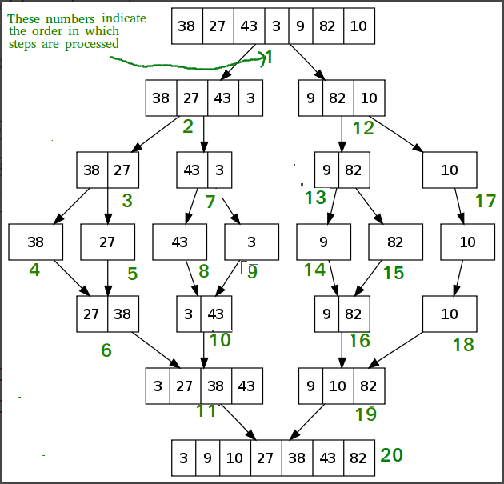

# Sorting And Searching

- [Sorting And Searching](#sorting-and-searching)
  - [Merge Sort](#merge-sort)
    - [Solution](#solution)

<br>

## Merge Sort
원문링크: https://www.geeksforgeeks.org/merge-sort/

<br>

> Like QuickSort, Merge Sort is a `Divide and Conquer` algorithm. It divides the input array into two halves, calls itself for the two halves, and then merges the two sorted halves. The merge() function is used for merging two halves. The merge(arr, l, m, r) is a key process that assumes that arr[l..m] and arr[m+1..r] are sorted and merges the two sorted sub-arrays into one. See the following C implementation for details.

```diff
MergeSort(arr[], l,  r)
If r > l
     1. Find the middle point to divide the array into two halves:  
             middle m = l+ (r-l)/2
     2. Call mergeSort for first half:   
             Call mergeSort(arr, l, m)
     3. Call mergeSort for second half:
             Call mergeSort(arr, m+1, r)
     4. Merge the two halves sorted in step 2 and 3:
             Call merge(arr, l, m, r)
```

> The following diagram from wikipedia shows the complete merge sort process for an example array {38, 27, 43, 3, 9, 82, 10}. If we take a closer look at the diagram, we can see that the array is recursively divided into two halves till the size becomes 1. Once the size becomes 1, the merge processes come into action and start merging arrays back till the complete array is merged.



Example:
```diff
Input: 12, 11, 13, 5, 6, 7
Output: 5, 6, 7, 1,1 12, 13
```

<br>

[소스로 이동](https://github.com/chelseafandev/geeksforgeeks/blob/main/SortingAndSearching/MergeSort.cpp)

<br>

### Solution

<br>

<details>
<summary>솔루션 보기</summary>
<div markdown="1">

<br>

<!-- contents -->

</div>
</details>